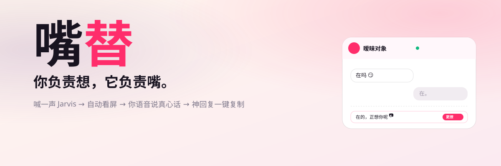
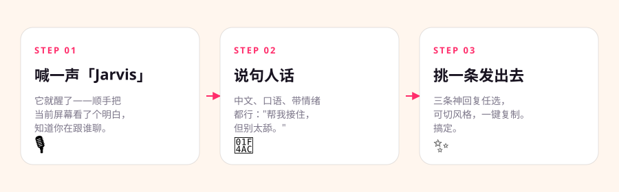
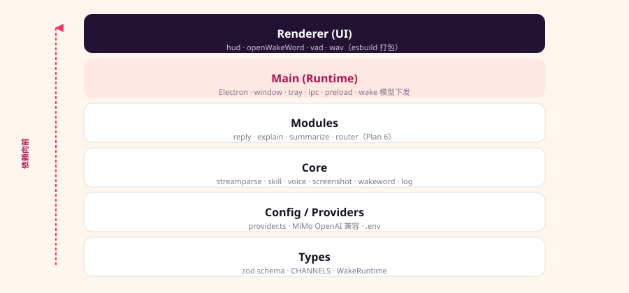

<div align="center">



# 嘴替 · 你负责想，它负责嘴

**真·常驻桌面助手：喊一声「Jarvis」→ 自动看屏 → 你语音说真心话 → 它给你几条能直接发的神回复，一键复制。**

[English](./README.en.md) · [展示页](./showcase/index.html) · [架构文档](./ARCHITECTURE.md)

</div>

---

> 暧昧对象发来"在吗"，你盯着屏幕憋三分钟，最后回了个"在"。
> 评论区想怼回去，当场大脑空白，洗完澡才想出王炸级回击。
> 跟领导请个假，草稿改八遍，发出去还是觉得自己在跪。
> 老外同事 @ 你，英文挤半天，一股扑面而来的机翻味。
>
> **你不是没话说，是那句最好的话永远卡在嘴边。**

嘴替把这个"卡在嘴边"变成"当场显灵"——不切窗口、不复制粘贴、不打字、不解释背景，喊一声 + 说句话就出结果。

## 核心特性

| | 特性 | 说明 |
|---|---|---|
| 🛸 | **托盘常驻 + 满高侧栏** | 满高右侧常驻悬浮、置顶，toggle 可收起，召唤即用，不打断你正在做的事 |
| 🎙️ | **三种唤醒方式** | 托盘点击 / 全局快捷键 / 语音「Jarvis」 |
| 🔒 | **本地离线唤醒词** | 基于 [openWakeWord](https://github.com/dscripka/openWakeWord) 的 ONNX 推理，**完全本地、离线、零 API Key、不持续传云端**——隐私向技术亮点 |
| 👀 | **自动看屏懂上下文** | 召唤时截屏一次，喂给多模态 LLM，它知道你在跟谁聊、聊到哪、什么气氛。**不做持续监视主动弹窗** |
| 🗣️ | **语音说真心话** | ASR 转写你的口语化输入（带情绪、中文、甚至脏话都行） |
| ⚡ | **流式蹦字 + 首句先播 TTS** | 主体回复走 session 级文本流式（pi `text_delta`，不绑字段名），首句一出就先念，结构化备选随后补上 |
| 🔄 | **连续多轮语音对话** | TTS 结束自动重开麦、10s 无人开口收麦待唤醒、多轮记忆（`MiraConversation` 持久 session），上下文跨轮保留 |
| 🎨 | **多风格备选** | 推荐一条 + 2-3 条带风格标签的备选（更撩 / 更刚 / 更稳 / 更专业 / 英文），一键复制 |
| 🤚 | **VAD 自动停止录音** | 纯 TS RMS 能量检测，说完自动停，不用手按 |
| ⚙️ | **应用内配置 + 首次向导** | 首次启动弹向导填 API Key，之后可在设置面板随时更改凭证 / 模型 / 偏好，立即生效，无需重启 |
| 🔴 | **错误可见** | 网络失败 / Key 无效等错误以带「去设置 / 重试」按钮的错误气泡呈现，连接状态点三色可视 |
| 🛡️ | **崩溃兜底 + 本地诊断** | 主进程未捕获异常自动写崩溃报告并重载渲染层；设置「诊断」面板可查近期运行统计、一键导出脱敏诊断包（apiKey 自动替换为 `***`）——**全本地，无数据上云** |
| 🧩 | **Skill 扩展底座** | 今天替你撩 / 怂 / 跟老板说话；现已扩展到小红书文案 / 催款催回复 / 回邮件（中英）/ 解读阴阳怪气 / 理性对线（守红线不网暴），共 8 个内置 skill，持续新增中 |

## 三步救场



| STEP 01 | STEP 02 | STEP 03 |
|---------|---------|---------|
| **喊一声「Jarvis」** | **说句人话** | **挑一条发出去** |
| 它就醒了——顺手把你当前屏幕看了个明白，知道你在跟谁聊、聊到哪。 | 中文、口语、带情绪都行："帮我接住，但别太舔。" | 三条神回复任选，可切风格，一键复制。搞定。 |

## 现场演示 · 你 vs 嘴替

> 💘 **谈恋爱** — 对象不开心，话到嘴边只会"哦哦"
>
> 对方：我今天有点不开心 😔
>
> 😶 你憋出来的：哦哦，怎么了
>
> **嘴替给你三条，挑一条发：**
> - 怎么啦，跟我说说？先别自己扛着。实在不行我陪你骂他，再请你吃顿好的。 `暖心`
> - 谁惹你了？告诉我，我帮你分析分析，顺便骂他。 `仗义`
> - 抱抱，别不开心了。要不要我给你讲个冷笑话，保证你笑。 `可爱`

> 😎 **对线** — 被阴阳怪气，当场只想骂回去
>
> 对方：就你这水平也好意思发出来？
>
> 🤬 你想发的：你他*说啥呢
>
> **嘴替给你三条，挑一条发：**
> - 看来你很懂，那正好——麻烦列三条具体的改进意见，我学习一下。空口点评谁都会，能动手的不多。 `机智`
> - 哈哈谢谢关注！不过我觉得挺好的，要不你发个更好的让我学习学习？ `从容`
> - 每个人审美不一样嘛，你觉得不好看可以划走，没必要留评论，多累啊 😄 `四两拨千斤`

> 💼 **职场分寸** — 想请假，又怕显得不靠谱
>
> 😬 你的草稿：王哥我明天想请个假
>
> **嘴替给你三条，挑一条发：**
> - 王哥，我明天有点私事要处理，想请一天假。手头的需求我今晚先推进一波，有急事随时找我，不耽误进度。 `靠谱`
> - 领导好，明天家里有点事想请假一天。本周任务我已经提前安排好了，交接文档也写好了，您放心。 `周全`
> - 王哥，明天能请个假吗？有急事。回来给您带杯咖啡补上 ☕ `轻松`

> 🌍 **英文彩蛋** — 旗舰技能，跨语言降维打击
>
> 你说（中文）：跟我说这改动下周才能 review，但要客气点别得罪人
>
> **嘴替 → 地道英文：** Thanks for the heads-up! I won't be able to get to this review until next week — really appreciate your patience. Happy to prioritize if it's blocking anything.

## 隐私设计

- **唤醒判断只在本地**：openWakeWord 跑在浏览器 WASM，不联网、不上云、无需 API Key。
- **不持续监听**：只在唤醒词命中后才触发录音与识别。
- **不持续监视屏幕**：只在被唤醒时看一次屏。
- **对线红线**：只做机智、有理有据的回怼——严禁人身攻击、脏话、歧视、教唆网暴。

## 凭什么不是又一个 AI

| 网页版 AI | 嘴替 |
|-----------|------|
| 要你复制粘贴 + 描述背景 | 👀 它自己看屏幕，召唤即截屏看懂 |
| 还得自己敲字想措辞 | 🎙️ 你只管开口，说句大白话就行 |
| 切窗口、打字、来回复制 | 🛸 常驻桌面、一句话唤醒、用完即隐 |

**真·桌面应用，不是一张网页 PPT。**

## 技术栈

TypeScript (ESM) · Node ≥ 22 · Electron 42 · `@earendil-works/pi-*`（agent 底座，单 session + Agent Skills）· onnxruntime-web · @picovoice/web-voice-processor · esbuild

LLM 走小米 MiMo（OpenAI 兼容端点，关 thinking）。

## 快速开始

```bash
# 1. 装依赖
npm ci

# 2. 配 .env（LLM/ASR/TTS key）—— 也可跳过，启动后在应用内配置（见下）
cp .env.example .env
# 填入 MiMo Token Plan 的 key（tp-xxxxx）

# 3. 下载 openWakeWord 模型（约 10MB，首次运行）
npm run fetch-models

# 4. 启动
npm start
```

**也可启动后在应用内配置 Key**：首次未配置时自动弹向导，填入 API Key + Base URL 后点「测试连接」验证，通过即可直接开聊。之后可随时点设置图标或状态点进入设置面板更改。

唤醒词默认关闭。在 `.env` 或启动 env 里设 `WAKE_THRESHOLD=0.5` 开启，`WAKE_DEBUG=1` 打调试日志。

## 开发

```bash
npm run typecheck     # 双 tsconfig 类型检查（主进程 + 渲染层；渲染层类型错误只有这里抓得到）
npm test              # 编译（tsconfig.json，不含 renderer）+ node:test（含架构 lint）
npm run test:e2e      # 真 MiMo e2e（需 .env 的 LLM key，CI 默认跳过）
npm run smoke:main    # 真 API 冒烟：core 层直连 LLM/ASR/TTS，不起 Electron
npm run smoke:electron # 真 API 冒烟：起 Electron + 真 IPC，覆盖多轮对话/错误分类/凭证热切换
npm run build         # 编译主进程 + esbuild 打包渲染层
npm run dev           # build + electron（带日志）
```

`npm test` 的 glob 只匹配 `dist/test/*.test.js`，**不会递归进 `dist/test/e2e/`**——e2e 测试只能靠 `npm run test:e2e` 触发，默认整体跳过（`E2E_SKIP`/`SHOULD_RUN_E2E` 控制），因为要花真 token 打真 MiMo key。三层测试各管一段：`npm test` 管纯函数/架构不变量（快、免费、每次提交跑）；`npm run test:e2e` 管 skill 路由和输出形状（真 key，按需跑）；`npm run smoke:electron` 管真实用户路径——多轮记忆、TTS 首句先播、错误分类到 UI、Settings 改凭证后立即生效（真 key + 真 Electron，人工触发，不进 CI）。

CI：push / PR 到 main 时自动跑 typecheck + test（`.github/workflows/ci.yml`）。e2e 和两个 smoke 脚本都要花真 API 调用，CI 不跑，需要手动执行。

## 架构



分层依赖只向前：`Types → Config → Core → Modules → Main → Renderer`。

```
src/
├── core/              # harness 底座（provider/mira-model/emit-tool/voice/screenshot/log）
├── modules/           # 嘴替单 session（mira/：session + conversation 多轮记忆）+ skill-runner（流式 + 组装 UniversalOutput）
├── main/              # Electron 主进程（满高侧栏窗口/托盘/IPC/唤醒词模型下发）
├── renderer/          # HUD 满高侧栏 + 本地 openWakeWord 唤醒（esbuild 打包，字段驱动渲染，对话流 UI）
├── shared/            # IPC 契约（ipc.ts）+ 连续对话状态机（conv-state.ts）
└── test/              # node:test（含 architecture.test.ts 架构 lint）
skills/                # Agent Skills：reply / explain / summarize / xiaohongshu / dun / email / decode / debate（每个一个 SKILL.md，渐进式披露）
```

关键不变量（机械强制）：
1. **MiMo 关 thinking**——挂工具时开 thinking 首字 21-32s，关掉 <1s 且"先文本流式 → 后 `emit_result`"顺序正确。
2. **结构化输出走 `emit_result` 工具**——主体 `primary` 走 session 文本流式（不绑字段名），不用 SDK json_schema（MiMo 不支持）。
3. **分层依赖红线**——renderer 不直接访问 Node，只经 `window.zuiti`（preload contextBridge）。

详见 [ARCHITECTURE.md](./ARCHITECTURE.md) · [AGENTS.md](./AGENTS.md)。

## 未来 · 一个梗，一座平台

底座是一个"看屏 + 语音 + 技能"的通用引擎，能不断长出新场景——一个停不下来的赛博嘴替。

`🥊 替你跟客服 battle` · `🌍 替你跟老外唠`

## 文档

- [架构文档](./ARCHITECTURE.md) — 分层 / 不变量 / 目录结构
- [展示页](./showcase/index.html) — 完整视觉展示

> 设计文档、执行计划、参赛资料为私有，不公开。

---

<div align="center">

**嘴替上线，回回封神。**

</div>

---

<div align="center">

Copyright © 2026 mountain · [All Rights Reserved](./LICENSE)

</div>
